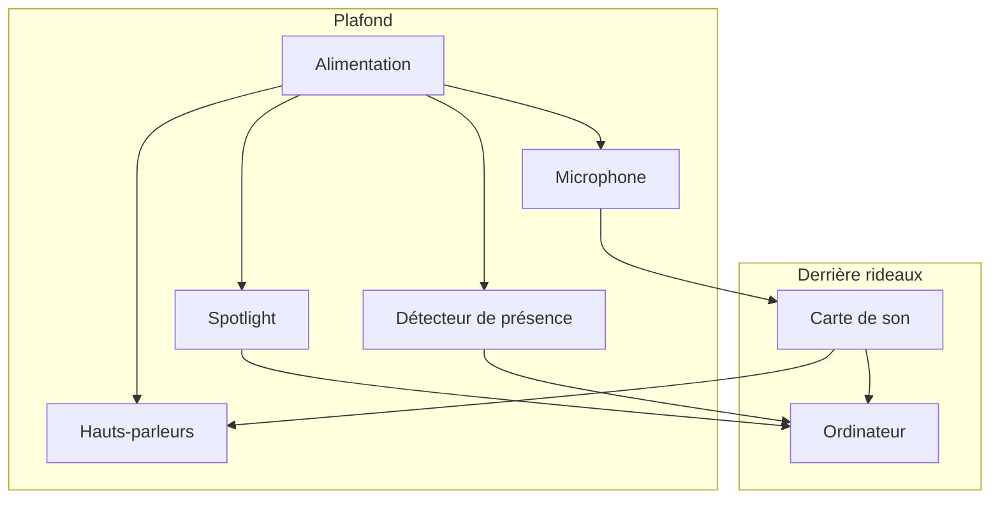

# ES-3 Planification

L'expérience se déroule dans une pièce sombre, entourée de rideaux noirs, avec trois micros suspendus au plafond. En s'approchant d'un micro, un spotlight s'allume, mettant l'utilisateur en lumière. En prenant la parole, sa voix est déformée, créant une expérience immersive qui explore l'anxiété de performance et les tensions liées à l'expression personnelle.

## Synoptique

## Plantation

## Simulation

## Scénarimage

    

## Devis Technique

### Matériels

#### Founi par l'artiste

#### Founi par l'école

### Logiciels

#### Founi par l'artiste

#### Founi par l'école

### Mise en réseau et de communication
